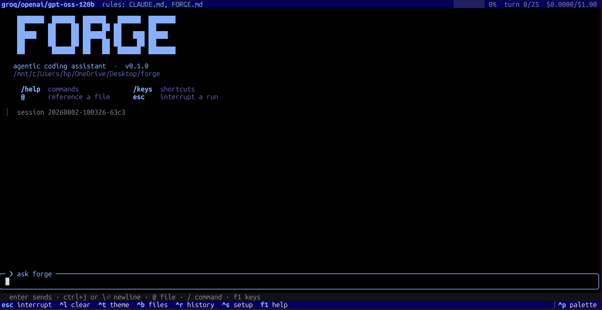
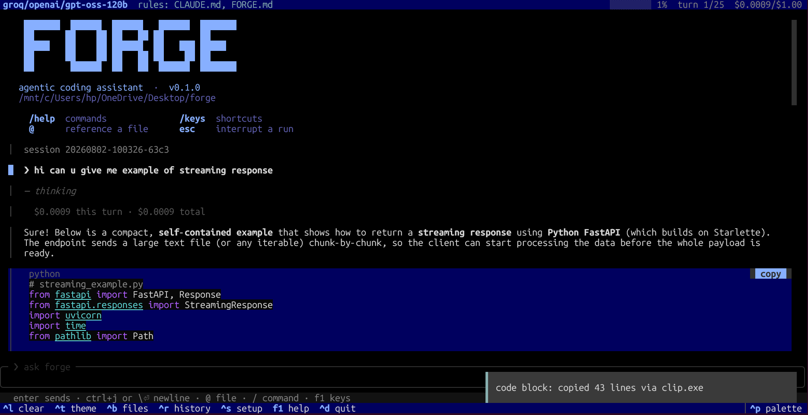
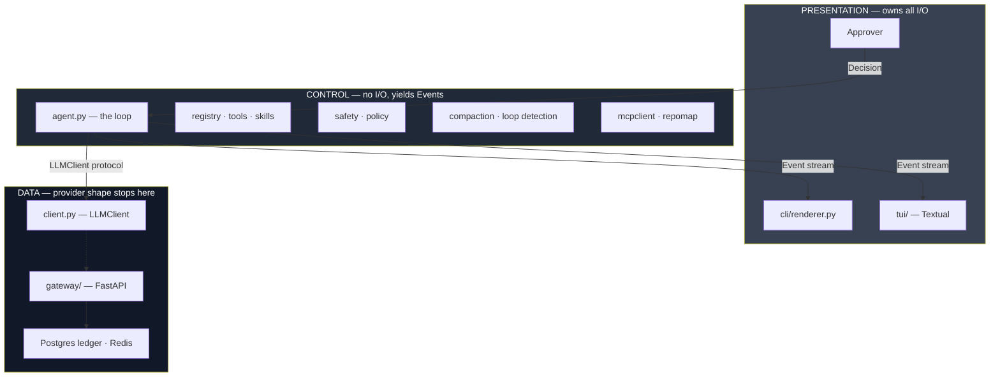
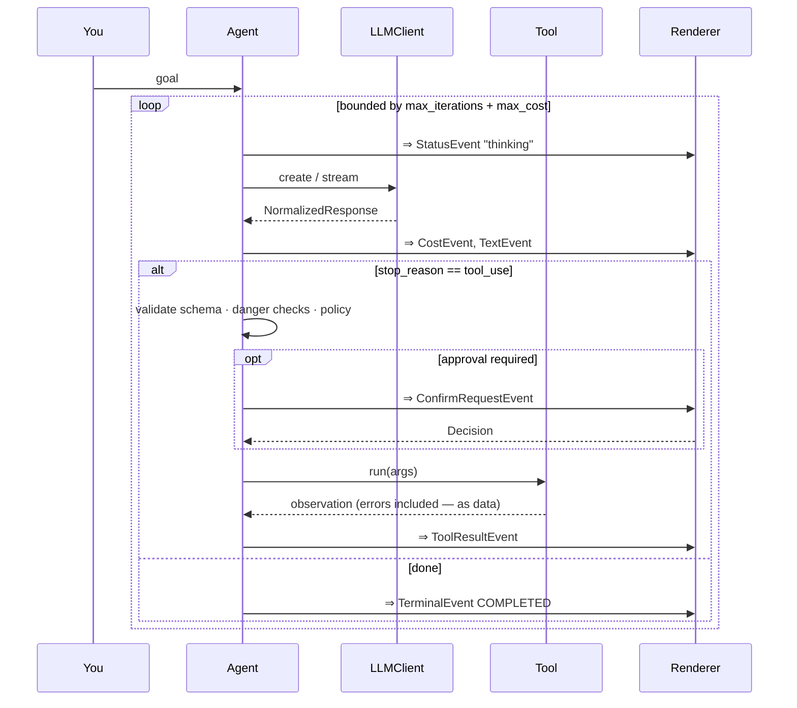
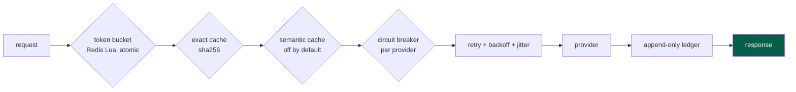
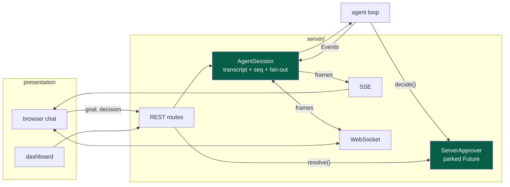
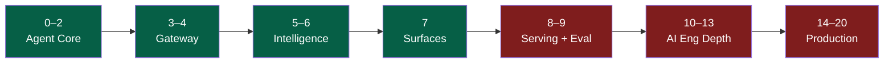

<div align="center">

<!-- ─────────────────────────────────────────────────────────────
     LOGO / BANNER
     Drop a file at docs/images/banner.png (recommended 1280×320)
     and it renders here.
     ───────────────────────────────────────────────────────────── -->


# FORGE

**An agentic CLI coding assistant, built from the metal up — including its own LLM gateway.**

[](https://python.org)
[](#testing)
[](https://docs.astral.sh/ruff/)
[](#roadmap)

*Give it a goal. It loops — model → tools → observations → repeat — until the task is done or a bound trips.*

</div>

---

<!-- ─────────────────────────────────────────────────────────────
     HERO SCREENSHOT — the TUI in action
     Drop a file at docs/images/tui.png
     ───────────────────────────────────────────────────────────── -->
<p align="center">
  
  <br><em>The Textual TUI: streamed output, tool panels, live cost, approval prompts.</em>
</p>

---

## What it is

FORGE reads and writes your files, runs shell commands, searches your repo, calls
external tools over **MCP**, delegates to **subagents**, and rides a **gateway you
own** that meters cost and adds resilience. It presents through a headless CLI and
a rich terminal UI — both subscribing to one event stream.

**Category peers:** Claude Code, Aider, Cursor's agent, OpenCode.

**What makes it different:** the gateway, the retrieval layer, the plugin host and
the multi-agent orchestration are all built here rather than imported. The
framework *is* the point — FORGE is a real tool and a staff-level systems
curriculum at the same time. `FORGE.md` is the syllabus; `lld.md` is the
engineering.

---

## Features

| | Capability | Detail |
|---|---|---|
| 🔁 | **Bounded ReAct loop** | Every run capped by `max_iterations` **and** `max_cost_usd`. No runaway meters. |
| 🧩 | **Plugin host** | Drop a module in `~/.forge/tools/`. No core edit. Broken plugins are quarantined, never fatal. |
| 🛡️ | **Layered approval** | Always-on danger checks + a policy engine + a human approver. Edited calls are re-validated from scratch. |
| 🧠 | **Context governors** | Pair-safe compaction at 80% of the window; cycle detection over `(tool, args, result)` fingerprints. |
| 🗺️ | **Structural retrieval** | tree-sitter symbols → personalized PageRank → token-budgeted repo map, mtime-cached in SQLite. |
| 🔌 | **MCP federation** | stdio + HTTP/SSE. Remote tools land in the same registry, namespaced and approval-gated identically. |
| 🪆 | **Subagents** | Isolated child contexts. Only the distilled result returns to the parent. |
| 🚪 | **Your own gateway** | OpenAI-compatible FastAPI service: token bucket → cache → circuit breaker → retry → append-only ledger. |
| 💾 | **Resumable sessions** | Atomic checkpoints every turn. `--resume <id>` picks up exactly where it stopped. |
| 🖥️ | **Two surfaces, one core** | Headless CLI and a Textual TUI with 30 slash commands, `/undo`, `@file` completion, themes. |

---

## Architecture

Three planes. Two seams. Nothing else crosses.



**The agent core never prints.** It yields `Event` objects. The renderer is the
only thing that writes to stdout — which is precisely why a TUI could be added in
Phase 7 without touching a line of `agent.py`.

**The agent never imports a provider SDK.** It depends on an `LLMClient` Protocol.
Swapping `AnthropicClient` for `GatewayClient` in Phase 3 changed zero bytes of
the loop.

<!-- ─────────────────────────────────────────────────────────────
     ARCHITECTURE DIAGRAM (hand-drawn / excalidraw, optional)
     Drop a file at docs/images/architecture.png
     ───────────────────────────────────────────────────────────── -->
<p align="center">
  
</p>

📖 **Full mechanism, class by class:** [`lld.md`](lld.md)

---

## How a turn works



A tool failure is **data, not a crash**: a schema error, a denial, or a raised
exception all come back as an observation string the model reads and corrects
from. Nothing in the dispatch path can kill a run.

---

## Quick start

```bash
git clone https://github.com/kshzz24/forge.git
cd forge
python -m venv .venv && . .venv/Scripts/activate    # Linux/macOS: . .venv/bin/activate
pip install -e .
```

Set the key for your provider:

```bash
export ANTHROPIC_API_KEY=...     # or OPENAI_API_KEY / GROQ_API_KEY
```

Run it:

```bash
forge "add a --verbose flag to the CLI and a test for it"   # headless
forge                                                        # interactive TUI
forge --list-sessions                                        # what have I run?
forge --resume 20260802-a3f1                                 # pick one back up
```

First TUI launch walks you through a provider/model chooser and writes
`~/.forge/config.toml`. Re-run it any time with `/setup`.

---

## Configuration

Precedence, lowest to highest:

```
model defaults  <  ~/.forge/config.toml  <  ./.forge/config.toml  <  CLI flags
```

```toml
# .forge/config.toml
provider       = "anthropic"
model          = "claude-opus-4-8"
max_iterations = 25
max_cost_usd   = 1.0
approval_mode  = "on-request"      # auto | on-request | never
# allowlist    = ["read_file", "grep", "glob"]   # omit to allow everything

[gateway.ratelimit]
capacity        = 60
refill_per_sec  = 1.0

[gateway.breaker]
fail_threshold = 5
cooldown_sec   = 30
```

A typo'd key is a **loud error**, not a silent no-op (`extra="forbid"`).

---

## Extending it

<details>
<summary><b>Add a tool</b> — drop a module in <code>~/.forge/tools/</code></summary>

```python
# ~/.forge/tools/word_count.py
from tools.base import ToolKind

KIND = ToolKind.READ
SCHEMA = {
    "name": "word_count",
    "description": "Count words in a file.",
    "parameters": {
        "type": "object",
        "properties": {"path": {"type": "string"}},
        "required": ["path"],
    },
}

async def run(args: dict) -> str:
    return str(len(open(args["path"]).read().split()))
```

It is schema-validated, allowlist-filtered and approval-gated exactly like a
builtin. A tool that fails to import is quarantined and reported — FORGE still
starts.
</details>

<details>
<summary><b>Add a skill</b> — markdown in <code>~/.forge/skills/</code></summary>

```markdown
---
name: reviewing-prs
description: Use when reviewing a pull request or diff.
---

Read the diff first, then the surrounding code. Check for…
```

Only the `name` + `description` sit in the system prompt. The body loads on
demand when the model calls `skill("reviewing-prs")` — so skills cost context
only when used.
</details>

<details>
<summary><b>Connect an MCP server</b> — <code>.mcp.json</code></summary>

```json
{
  "mcpServers": {
    "github": {
      "command": "npx",
      "args": ["-y", "@modelcontextprotocol/server-github"],
      "env": { "GITHUB_TOKEN": "${GITHUB_TOKEN}" }
    }
  }
}
```

Tools arrive namespaced as `github__create_issue`. A server that will not start
is reported through `/mcp` and skipped — it never blocks startup.
</details>

---

## The gateway

Optional. Point FORGE at it and metering, caching and resilience appear —
transparently.

```bash
export FORGE_LEDGER_DSN=postgresql://localhost/forge
uvicorn gateway.server:app --port 8080

forge --gateway-url http://localhost:8080 "refactor the parser"
```



If the gateway is unreachable, `GatewayClient` falls back to a direct provider
call. **You lose metering, not availability** — and the agent cannot tell.

`GET /stats` exposes p95 latency, error rate, $/model and cache-hit ratio. The
`checkup/` dashboard reads it.

<!-- ─────────────────────────────────────────────────────────────
     DASHBOARD SCREENSHOT
     Drop a file at docs/images/dashboard.png
     ───────────────────────────────────────────────────────────── -->
<p align="center">
  
</p>

---

## The server

The same agent, over HTTP. One process holds many sessions; every surface — the
browser chat, the dashboard, `curl` — subscribes to the same event stream.

```bash
npm --prefix web run build          # builds into server/static/

export FORGE_SERVER_TOKEN="$(python -c 'import secrets;print(secrets.token_urlsafe(24))')"
forge serve                         # 127.0.0.1:8000
```

Then open `http://127.0.0.1:8000/?token=<the token>`.



Three things worth knowing:

- **Every frame is numbered.** A client reconnects with `Last-Event-ID` and gets
  exactly the tail it missed — including a confirm it was mid-answer on, so a
  hard reload re-opens the modal instead of stranding the run.
- **Approval crosses the network as a parked `asyncio.Future`.** The agent
  suspends inside `decide()`; a second request resolves it. It does not deadlock
  because each transport is its own task draining its own queue.
- **`--host` defaults to `127.0.0.1`, and binding anything else has to be
  typed.** Phase-2 user tools run in this process, so that flag's blast radius is
  the whole machine. Auth is one bearer token compared with `compare_digest`, and
  the server refuses to start without it.

| Route | |
|---|---|
| `POST /api/sessions` | create; a `goal` starts the run immediately |
| `GET /api/sessions` | live + checkpointed sessions |
| `POST /api/sessions/{id}/goal` | next turn (409 while one is in flight) |
| `POST /api/sessions/{id}/decisions` | answer a confirm (409 if stale) |
| `POST /api/sessions/{id}/interrupt` | cancel, checkpoint, keep the session |
| `DELETE /api/sessions/{id}` | evict from memory; the checkpoint survives |
| `GET /api/sessions/{id}/events` | SSE stream |
| `WS /ws/sessions/{id}` | the same frames, duplex |
| `GET /api/stats` | gateway metrics, or `{"available": false}` |

---

## The repo map

Rung two of the retrieval ladder — cheaper than embeddings, far better than grep
alone, and CLI-native.

```
tree-sitter parse  →  def/ref tags  →  personalized PageRank  →  token-budgeted render
                             ↑
                    SQLite cache keyed on mtime
                    (the OS hands you invalidation for free)
```

Files that many others depend on rank high. Dunders and symbols defined in more
than three files are dropped before edges are built — `get`/`run`/`put` are name
collisions, not dependencies.

<!-- Drop a file at docs/images/repomap.png -->
<p align="center">
  
</p>

---

## TUI reference

<details>
<summary><b>30 slash commands</b></summary>

| | |
|---|---|
| `/help` `/keys` | commands and shortcuts |
| `/config` `/tools` `/mcp` | what's loaded |
| `/model` `/provider` `/approval` | switch mid-session, keeping your task list |
| `/plan` `/yolo` | propose-before-editing · approve everything |
| `/undo` `/redo` `/files` | revert the agent's last turn |
| `/save` `/sessions` `/resume` `/clear` | session control |
| `/cost` `/stats` `/context` `/compact` | budget and window |
| `/todo` | the agent's task list |
| `/copy` `/autocopy` `/find` | transcript |
| `/prompt` `/reindex` `/theme` `/bell` `/setup` `/quit` | the rest |

</details>

`/undo` works because `Hooks.before_tool` snapshots a file before the agent
overwrites it — a Phase-2 seam that was five no-ops until Phase 7 filled it. The
agent core changed by zero lines to gain undo.

---

## Testing

```bash
pytest              # 793 tests
ruff check .
python -m evals.runner    # golden-task suite against a real model
```

Tests assert on the `TerminalReason` **enum**, never on rendered strings — so a
copy change never breaks a test. The gateway suite includes a cache-poisoning
test and a gate-chain ordering test: both check a *policy decision*, not just a
function.

---

## Roadmap



| Phase | Ships | Status |
|---|---|:--:|
| 0 · Spine | async loop, `LLMClient`, 3 tools, renderer | ✅ |
| 1 · Survival | event taxonomy, compaction, loop detection, cost meter | ✅ |
| 2 · Plugin host | registry, schema validation, layered config, hooks | ✅ |
| 3 · Gateway v1 | OpenAI-compatible service, router, append-only ledger | ✅ |
| 4 · Gateway depth | cache, token bucket, circuit breaker, metrics | ✅ |
| 5 · Agent depth | skills, approval policy, subagents, checkpoints | ✅ |
| 5.5 · Repo map | tree-sitter + PageRank + mtime cache | ✅ |
| 6 · MCP | transport-abstracted client, tool federation | ✅ |
| 7 · Surfaces | Textual TUI, metrics dashboard | ✅ |
| 8 · Server | agent-as-a-service, chat UI, SSE fan-out | ✅ |
| 9 · Eval | golden tasks in CI, tracing spans, LLM-as-judge | ⬜ |
| 10–13 | RAG, planner + reflection, guardrails, adaptive routing | ⬜ |
| 14–20 | OpenTelemetry, orchestration, event sourcing, RBAC, deploy | ⬜ |

Nothing later than the current phase is scaffolded. That is the rule:
**every phase ends in running code, or it didn't happen.**

---

## Documentation

| Doc | What it owns |
|---|---|
| [`lld.md`](lld.md) | **Mechanism.** Classes, algorithms, data shapes, every diagram. |
| [`FORGE.md`](FORGE.md) | **Intent.** The 21-phase curriculum, concepts, SDE-3 lens per phase. |
| [`CLAUDE.md`](CLAUDE.md) | **Invariants.** What must hold in every phase, forever. |
| [`tracking.md`](tracking.md) | The high-level map. |
| `graphify-out/GRAPH_REPORT.md` | Knowledge graph: 620 nodes, god nodes, communities, cycles. |

---

## Stack

`Python 3.11+` · `anthropic` + `openai` SDKs · `FastAPI` · `Pydantic` ·
`asyncpg` / Postgres · `Redis` · `Textual` · `tree-sitter` · `NumPy` ·
`jsonschema` · `pytest` · `ruff`

---

<div align="center">

*Built as a curriculum. Runs as a tool.*

</div>
